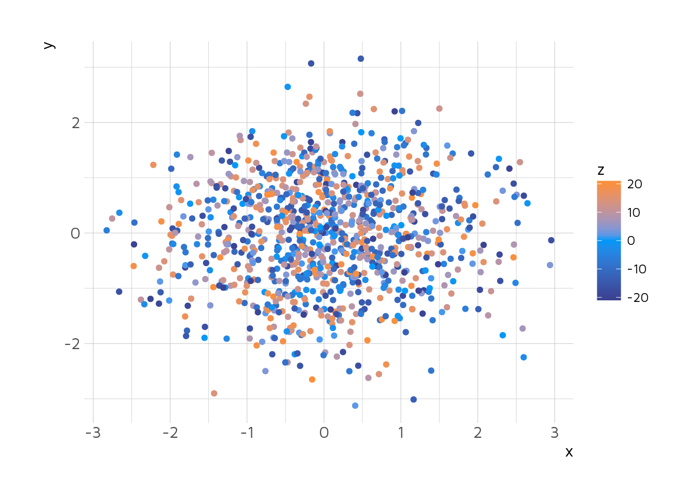
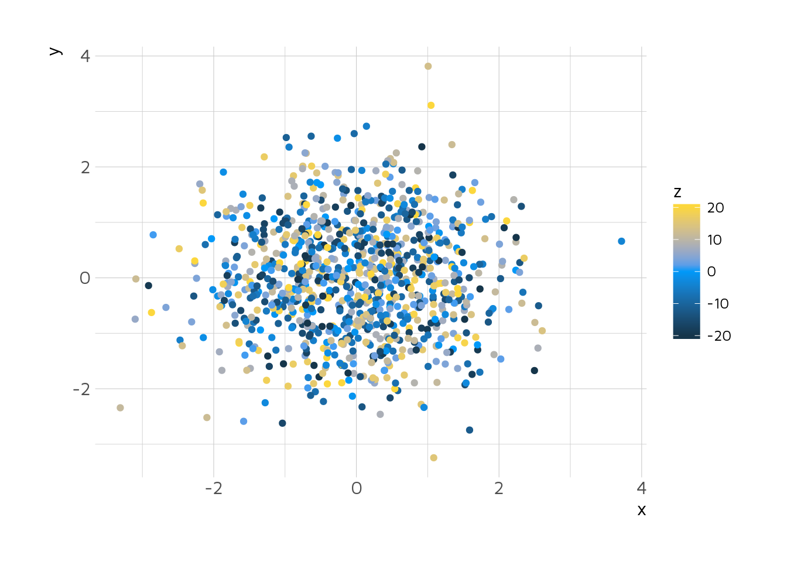
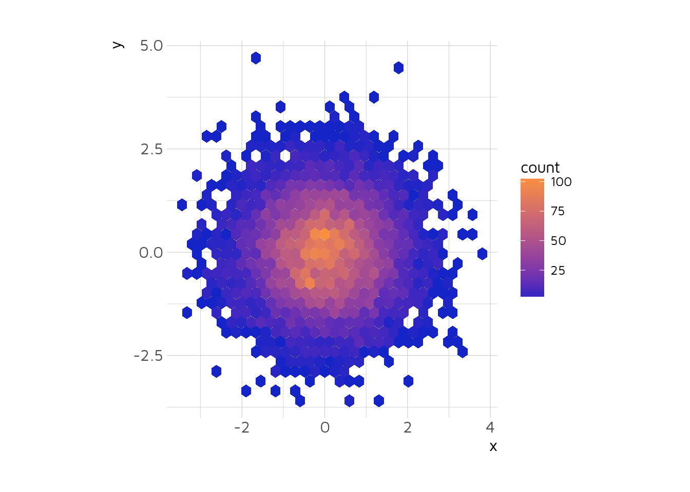
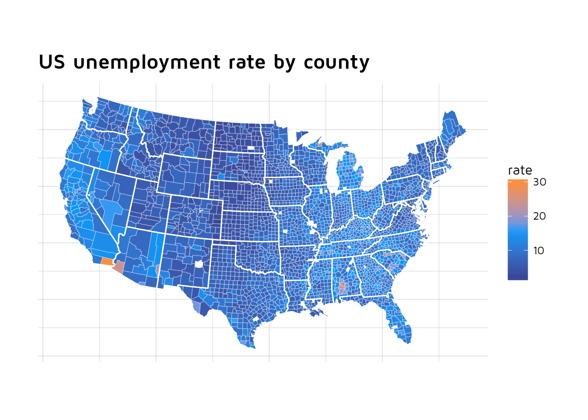
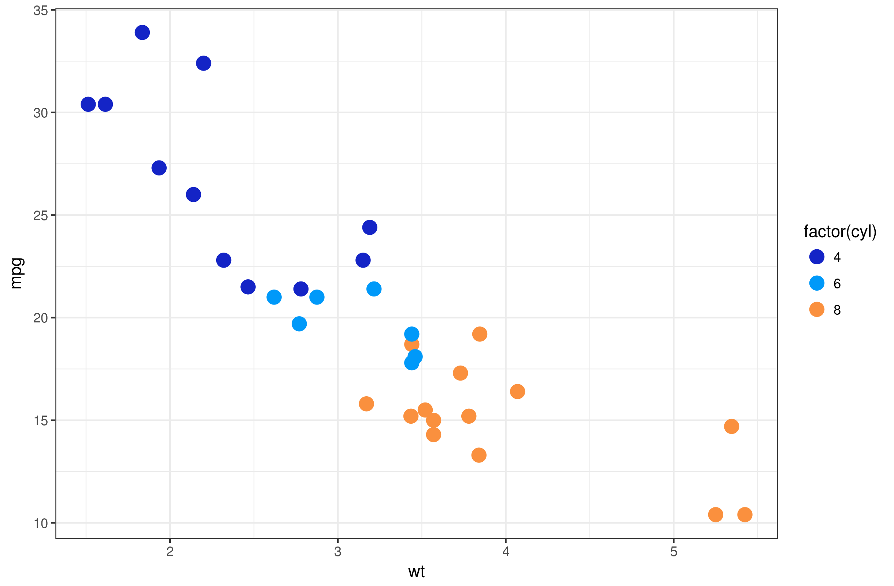

UI Style Guide
==============

The goal of this document is to create beautiful and coherent style guide for Shiny apps, R markdown report and charts made by Appsilon.

Minimum plan is to have: \* color pallets \* functions styling ggplots and plotly

Nice to have: \* ggplot theme

What we need?
-------------

Color pallets - 2 color pallets: 1 continuous data, 2 categorical data Charts theme - ggplot and plotly

### Theme

Since we use Maven Pro as your font, the Maven Pro theme was added to hrbrthemes(). You can download the package with the theme from [Appsilon hrbrthemes fork](https://github.com/Appsilon/hrbrthemes):

`devtools::install_github("Appsilon\hrbrthemes")`

and access theme `theme_ipsum_mp()`

### Maven Pro

``` r
ggplot(mtcars, aes(mpg, wt)) +
  geom_point() +
  labs(x = "Fuel effiiency (mpg)", y = "Weight (tons)",
       title = "Seminal ggplot2 scatterplot example",
       subtitle = "A plot that is only useful for demonstration purposes",
       caption = "Brought to you by the letter 'g'") + 
  theme_ipsum_mp()
```


### Continous

Scale was created starting from <span style="color:#FA903E">"\#FA903E"</span> mid <span style="color:#1424C6">"\#1424C6"</span> and finish <span style="color:#0099F9">"\#0099F9"</span> based on [kuler](https://color.adobe.com/create/color-wheel/?base=2&rule=Compound&selected=2&name=My%20Color%20Theme&mode=rgb&rgbvalues=0.07764705882352939,0.139242791599822,0.776470588235294,0.23058823529411765,0.2610750121227878,0.5764705882352941,0,0.6,0.9764705882352941,0.9794117647058823,0.5660503410702158,0.24485294117647058,0.776470588235294,0.2813068745571549,0.07764705882352939&swatchOrder=0,1,2,3,4) of compound colors with the center on Appsilon blue <span style="color:#0099F9">"\#0099F9"</span>.

#### Plot examples

Goal: check how viridis examples are represented using poropose continous scale.

Ggplots are generated using `scale_*_gradient(low = "#1424C6", high = "#FA903E")`



    ## 
    ## Attaching package: 'maps'

    ## The following object is masked _by_ '.GlobalEnv':
    ## 
    ##     unemp



### Categorical



What we considered?
-------------------

-   Coherent with Appsilon branding
-   Print friendly
-   Robust to colorblindness
-   Pretty

What we chose?
--------------
