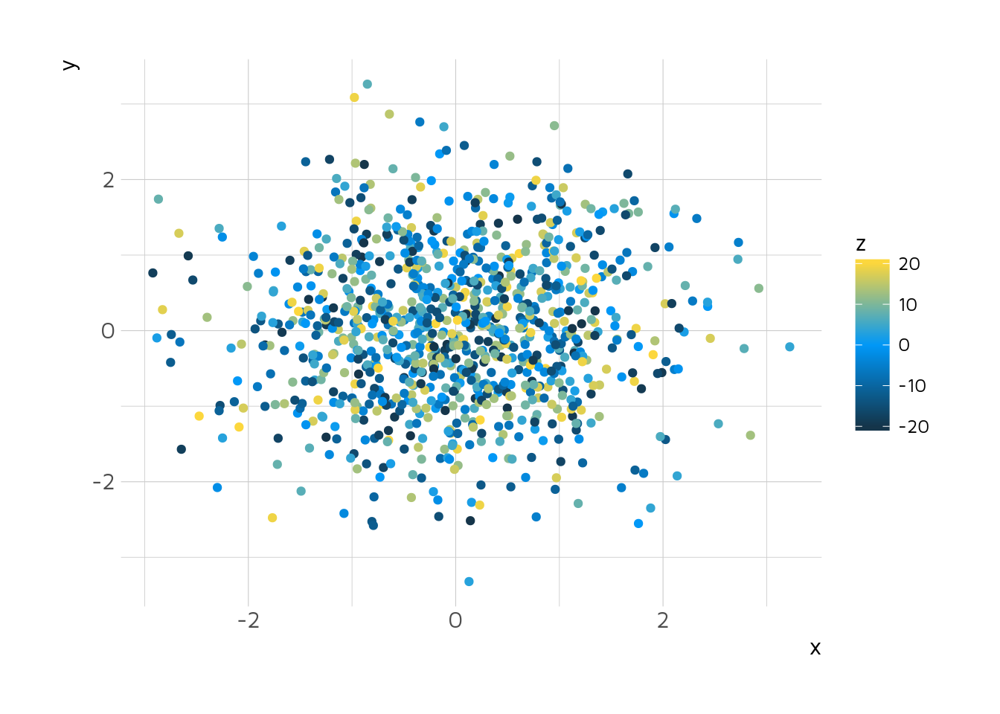

UI Style Guide
==============

The goal of this document is to create beautiful and coherent style guide for Shiny apps, R markdown report and charts made by Appsilon.

Minimum plan is to have: \* color palettss \* functions styling ggplots and plotly

Nice to have: \* ggplot theme

What we need?
-------------

Color palletss - 2 color paletss: 1 continuous data, 2 categorical data Charts theme - ggplot and plotly

### Theme

Since we use Maven Pro as your font, the Maven Pro theme was added to hrbrthemes(). You can download the package with the theme from [Appsilon hrbrthemes fork](https://github.com/Appsilon/hrbrthemes):

`devtools::install_github("Appsilon\hrbrthemes")`

and access theme `theme_ipsum_mp()`

### Maven Pro

``` r
ggplot(mtcars, aes(mpg, wt)) +
  geom_point() +
  labs(x = "Fuel effiiency (mpg)", y = "Weight (tons)",
       title = "Seminal ggplot2 scatterplot example",
       subtitle = "A plot that is only useful for demonstration purposes",
       caption = "Brought to you by the letter 'g'") + 
  theme_ipsum_mp()
```


### Continous Palettes

#### Appsilon viridis


#### Appsilon cividis


#### Appsilon plasma


#### Plot examples

Goal: check how viridis examples are represented using propose continuous scale.



    ## 
    ## Attaching package: 'maps'

    ## The following object is masked _by_ '.GlobalEnv':
    ## 
    ##     unemp


### Categorical


What we considered?
-------------------

-   Coherent with Appsilon branding
-   Print friendly
-   Robust to colorblindness
-   Pretty

What we chose?
--------------
